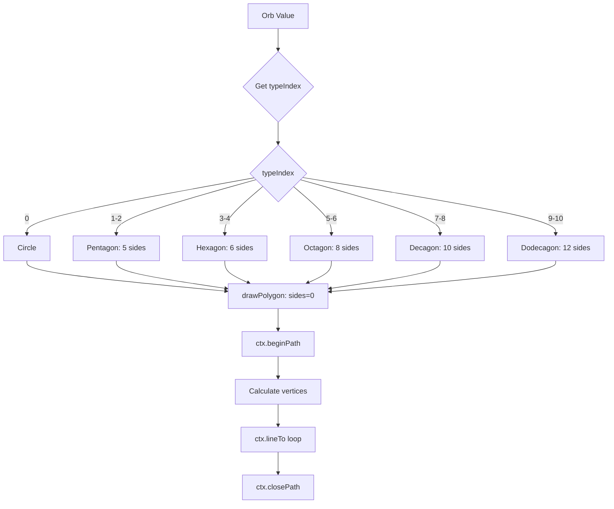

# Orb Polygon Shapes Plan (Updated)

## Overview
Assign different polygon shapes to different orb values using a cyclical grouping pattern where multiple values share the same shape.

## Shape Mapping (Cyclical Grouping)

| Orb Values | Shape | Sides | Notes |
|-----------|-------|-------|-------|
| 2 | Circle | 0 | Single value - base shape |
| 4, 8 | Pentagon | 5 | First cycle |
| 16, 32 | Hexagon | 6 | Second cycle |
| 64, 128 | Octagon | 8 | Third cycle |
| 256, 512 | Decagon | 10 | Fourth cycle |
| 1024, 2048 | Dodecagon | 12 | Fifth cycle (max) |

## Architecture



## Implementation Steps

### Step 1: Add polygon helper to vfxHelpers.js
Create `drawPolygon(ctx, x, y, radius, sides, rotation)` function.

### Step 2: Add helper to get shape by typeIndex in theme.js
Add a helper function `getOrbShape(typeIndex)` that returns the number of sides:
```javascript
// 0 = circle, 5 = pentagon, 6 = hexagon, 8 = octagon, 10 = decagon, 12 = dodecagon
export function getOrbShape(typeIndex) {
  if (typeIndex === 0) return 0   // value 2: circle
  if (typeIndex <= 2) return 5   // values 4, 8: pentagon
  if (typeIndex <= 4) return 6   // values 16, 32: hexagon
  if (typeIndex <= 6) return 8   // values 64, 128: octagon
  if (typeIndex <= 8) return 10  // values 256, 512: decagon
  return 12                        // values 1024, 2048: dodecagon
}
```

### Step 3: Update orbRenderer.js
1. Import `getOrbShape` from theme.js
2. Create a helper that draws either circle or polygon based on shape
3. Modify drawing functions to use the shape-aware drawing

Key changes in orbRenderer.js:
- Replace `ctx.arc(x, y, radius, 0, Math.PI * 2)` calls with shape-aware path
- Apply same shape to shadows, fills, and outlines

## Files to Modify

1. **src/visuals/vfxHelpers.js** - Add `drawPolygon()` helper
2. **src/visuals/theme.js** - Add `getOrbShape(typeIndex)` function
3. **src/visuals/orbRenderer.js** - Use shape-aware drawing

## Helper Function

```javascript
/**
 * Draw a regular polygon or circle
 * @param {CanvasRenderingContext2D} ctx 
 * @param {number} x - Center X
 * @param {number} y - Center Y
 * @param {number} radius - Radius
 * @param {number} sides - 0 = circle, 3+ = polygon
 * @param {number} rotation - Rotation in radians (default: 0)
 */
export function drawPolygon(ctx, x, y, radius, sides, rotation = 0) {
  if (!sides || sides < 3) {
    // Draw circle for invalid side counts
    ctx.arc(x, y, radius, 0, Math.PI * 2)
    return
  }
  
  ctx.beginPath()
  const angleStep = (Math.PI * 2) / sides
  
  for (let i = 0; i < sides; i++) {
    const angle = angleStep * i + rotation - Math.PI / 2
    const px = x + radius * Math.cos(angle)
    const py = y + radius * Math.sin(angle)
    
    if (i === 0) {
      ctx.moveTo(px, py)
    } else {
      ctx.lineTo(px, py)
    }
  }
  
  ctx.closePath()
}
```

## Design Notes

- **Cyclical Pattern**: Each group of 2 consecutive type indices (except first) shares the same shape
- **Progressive Complexity**: Higher values = more sides = more complex polygon
- **Shape Cap**: Dodecagon (12 sides) is maximum - no need to exceed this for visual clarity
- **Consistent Shadows**: Polygons use same polygon path for shadow, fill, and outline
